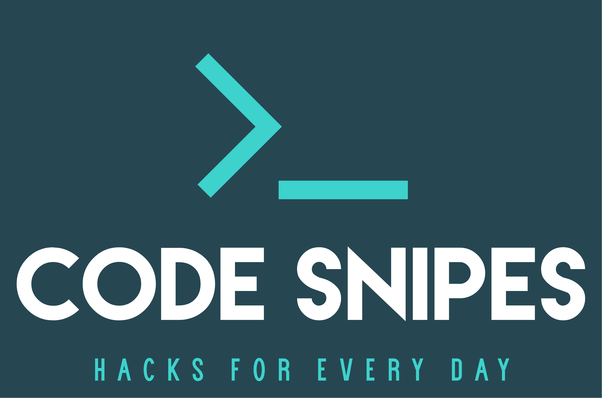

<!--
*** To avoid retyping too much info. Do a search and replace for the following:
*** adminph-de, ps-azure-bginfo, N00ky2010, patrick.hayo@flsmidth.com
-->

# BGInfo Deployment on Azure IaaS 

[![Contributors][contributors-shield]][contributors-url]
[![Forks][forks-shield]][forks-url]
[![Stargazers][stars-shield]][stars-url]
[![Issues][issues-shield]][issues-url]
[![MIT License][license-shield]][license-url]
[![LinkedIn][linkedin-shield]][linkedin-url]

<br />
<p align="left">
  <a href="https://github.com/adminph-de/ps-azure-bginfo">
    
  </a>
  <p align="left">
    Output your ASR status into a PowerBI report by using PowerShell
    <br />
    <a href="https://github.com/adminph-de/ps-azure-bginfo/issues">Bug Report</a>
    ·
    <a href="https://github.com/adminph-de/ps-azure-bginfo/issues">Request Feature</a>
  </p>
</p>


## Content

- BGInfo Deployment on Azure IaaS
  - [Content](#content)
  - [Prerequisites](#Prerequisites)
  - [Installation](#installation)
  - [Usage](#usage)
  - [Contributing](#contributing)
  - [License](#license)
  - [Contact](#contact)
  - [Acknowledgements](#acknowledgements)
  - [Referenzes](#referenzes)


### Prerequisites

Running the script in the end, you need the Azure "AZ" module installed. Here the simple installation (it works the same way in the Docker container)
[InstallAzure Module "AZ"](https://docs.microsoft.com/en-us/powershell/azure/install-az-ps?view=azps-4.4.0)
```powershell
if ($PSVersionTable.PSEdition -eq 'Desktop' -and (Get-Module -Name AzureRM -ListAvailable)) {
    Write-Warning -Message ('Az module not installed. Having both the AzureRM and ' +
      'Az modules installed at the same time is not supported.')
} else {
    Install-Module -Name Az -AllowClobber -Scope CurrentUser
}
```

## Installation

Clone the git reop to start:
```sh
git clone https://github.com/adminph-de/ps-azure-bginfo.git
```

## Usage

Change the JSON file (bginfo.json):
```json
[
    {
       "bginfo": {
           "location": "westeurope",
           "resourcegroup": "myRG",
           "vmname": "myVm"
     }
    }
]
````

Execute the script:
```bash
ps-azure-bginfo.ps1
``` 

Copy the ```config.bgi``` file to ```C:\Packages\Plugins\Microsoft.Compute.BGInfo\2.1\```

Output after running:
<p align="left">
  <a href="https://github.com/adminph-de/ps-azure-bginfo">
    
  </a>


## Contributing

Contributions are what make the open source community such an amazing place to be learn, inspire, and create. Any contributions you make are **greatly appreciated**.

1. [Fork](https://docs.github.com/en/enterprise/2.13/user/articles/fork-a-repo) the Project
2. Create your Feature Branch `git checkout -b feature/AmazingFeature`
3. Commit your Changes `git commit -m 'Add some AmazingFeature'`
4. Push to the Branch `git push origin feature/AmazingFeature`
5. Open a Pull Request


## License

Distributed under the [MIT](https://choosealicense.com/licenses/mit/) License. See `LICENSE` for more information.


## Contact

Project Link: [https://github.com/adminph-de/ps-azure-bginfo](https://github.com/adminph-de/ps-azure-bginfo)

[Patrick Hayo](patrick.hayo@flsmidth.com)

[](https://www.twitter.com/N00ky2010)


## Acknowledgements

* [Janaina Laguardia Areal Hyldvang, Ph.D.](https://www.linkedin.com/in/janainahyldvang/)
* [Jakob Daugaard](https://www.linkedin.com/in/jakobdaugaard/?locale=en_US)
* [Senthil Kumar Bose](https://www.linkedin.com/in/senthil-kumar-bose-6900582/)
* [Javed Khan](https://www.linkedin.com/in/javed-khan-674863164/)


## Referenzes

* [Create an Azure service principal](https://docs.microsoft.com/en-us/powershell/azure/create-azure-service-principal-azureps?view=azps-4.4.0)
* [BGInfo](https://docs.microsoft.com/en-us/sysinternals/downloads/bginfo/)


<!-- https://www.markdownguide.org/basic-syntax/#reference-style-links -->
[contributors-shield]: https://img.shields.io/github/contributors/adminph-de/ps-azure-bginfo.svg?style=flat-square
[contributors-url]: https://github.com/adminph-de/ps-azure-bginfo/graphs/contributors
[forks-shield]: https://img.shields.io/github/forks/adminph-de/ps-azure-bginfo.svg?style=flat-square
[forks-url]: https://github.com/adminph-de/ps-azure-bginfo/network/members
[stars-shield]: https://img.shields.io/github/stars/adminph-de/ps-azure-bginfo.svg?style=flat-square
[stars-url]: https://github.com/adminph-de/ps-azure-bginfo/stargazers
[issues-shield]: https://img.shields.io/github/issues/adminph-de/ps-azure-bginfo.svg?style=flat-square
[issues-url]: https://github.com/adminph-de/ps-azure-bginfo/issues
[license-shield]: https://img.shields.io/github/license/adminph-de/ps-azure-bginfo.svg?style=flat-square
[license-url]: https://github.com/adminph-de/ps-azure-bginfo/blob/master/LICENSE.txt
[linkedin-shield]: https://img.shields.io/badge/-LinkedIn-black.svg?style=flat-square&logo=linkedin&colorB=555
[linkedin-url]: https://www.linkedin.com/in/patrickhayo/?locale=en_US
[product-screenshot]: images/screenshot.png
[product-screenshot-run]: images/screenshot_run.png